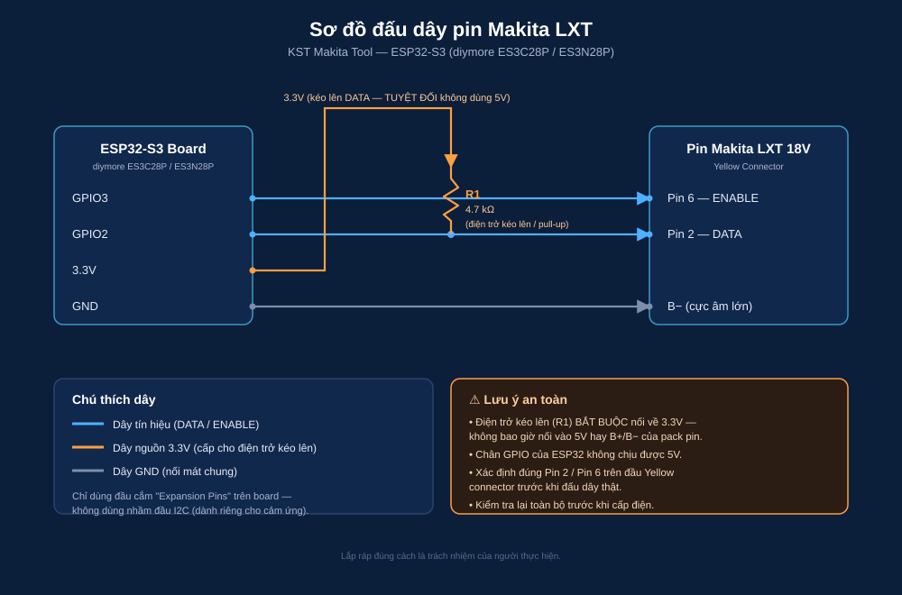
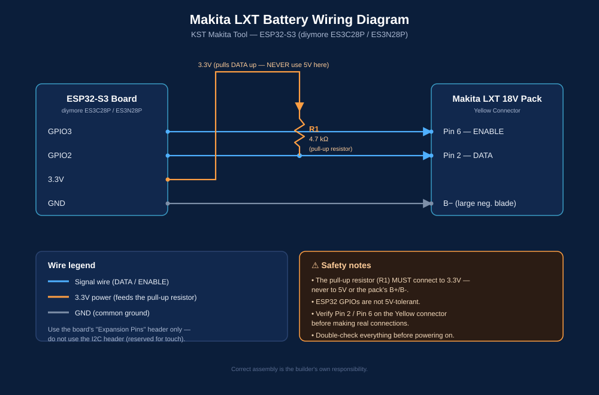

# KST Makita Tool

Bộ công cụ chẩn đoán / mở khóa pin Makita LXT 18V, chạy độc lập trên
ESP32-S3 (không cần máy tính). Hỗ trợ **song ngữ Tiếng Việt / English**
trên cả màn cảm ứng và trang web điều khiển qua WiFi.

Diagnostic / unlock tool for Makita LXT 18V battery packs, running fully
standalone on an ESP32-S3 (no PC required). Supports **Vietnamese / English**
on both the touchscreen UI and the WiFi web control page.

---

**[🇻🇳 Tiếng Việt](#-tiếng-việt) | [🇬🇧 English](#-english)**

---

## 🇻🇳 Tiếng Việt

### Giới thiệu

KST Makita Tool đọc thông tin và mở khóa các pack pin Makita LXT 18V
(BL1815/BL1820B/BL1830B/BL1850B...) qua giao thức 1-Wire độc quyền của
Makita. Chạy trên một board ESP32-S3 có màn hình cảm ứng 2.8", vừa có thể
thao tác trực tiếp trên màn hình, vừa có thể điều khiển qua trình duyệt
điện thoại (WiFi AP riêng, không cần Internet).

**Tính năng:**
- Đọc Model, ROM ID, ngày sản xuất, số lần sạc, điện áp từng cell, nhiệt
  độ, trạng thái khóa/lỗi.
- Xóa lỗi (Clear Error) / Mở khóa (Unlock) pin.
- Bật/tắt đèn LED trên pack pin.
- Giao diện **song ngữ VI/EN** (nút chuyển đổi trên cả 2 màn hình).
- Hiển thị pin LiPo của chính board (4 vạch, góc header màn cảm ứng).
- **Chế độ ngủ sâu (deep sleep)**: giữ nút BOOT 2 giây để tiết kiệm pin khi
  không dùng, bấm BOOT lần nữa để đánh thức.

### Danh sách linh kiện (BOM)

| Linh kiện | Ghi chú |
|---|---|
| Board ESP32-S3 diymore **ES3C28P** hoặc **ES3N28P** | Màn ILI9341V 2.8" 240x320, cảm ứng điện dung FT6336G (I2C), 16MB Flash, 8MB PSRAM |
| Pack pin Makita LXT 18V (5 cell) | BL1815 / BL1820B / BL1830B / BL1850B hoặc tương đương |
| Điện trở **4.7 kΩ** (1 con) | Kéo lên (pull-up) cho đường DATA |
| Dây dupont / dây dẫn | Nối Yellow connector của pack pin tới board |
| Pin Li-Po 3.7V (JST-PH 2 chân) | Tùy chọn — để board chạy độc lập không cần cắm Type-C liên tục (board có sẵn mạch sạc TP4054) |
| Cáp USB Type-C | Nạp firmware + sạc pin |

### Sơ đồ đấu dây



```
Yellow connector (pack Makita)      Board ESP32-S3
--------------------------------    --------------------------------
Pin 2 (DATA)   -- 4.7kΩ pull-up --> 3.3V
Pin 2 (DATA)   ------------------>  GPIO2  (MAKITA_ONEWIRE_PIN)
Pin 6 (ENABLE) ------------------>  GPIO3  (MAKITA_ENABLE_PIN)
B- (cực âm lớn) ------------------>  GND
```

Dùng đúng đầu cắm **"Expansion Pins"** trên board (IO2/IO3 còn trống) —
**KHÔNG dùng nhầm đầu I2C** vì đầu đó đã dành riêng cho cảm ứng màn hình.

> ⚠️ **An toàn:** điện trở kéo lên 4.7 kΩ bắt buộc nối về **3.3V**, không
> bao giờ nối vào 5V hay B+/B- của pack pin. Chân GPIO của ESP32 không
> chịu được 5V.

### Nạp firmware

Cần cài [PlatformIO](https://platformio.org/) (`pip install platformio`
hoặc extension PlatformIO IDE cho VS Code).

```bash
pio run -t upload --upload-port COMxx    # đổi COMxx thành cổng thật của bạn
pio device monitor -p COMxx -b 115200    # xem log qua Serial (tùy chọn)
```

Board dùng USB Type-C trực tiếp (native USB). Nếu máy tính không nhận cổng
COM sau khi cắm dây, thử giữ nút **BOOT** rồi cắm Type-C vào (ép vào chế độ
nạp), sau đó thả nút ra.

Mặc định firmware chạy **chế độ demo** (dữ liệu giả lập, không cần pin
thật) để test giao diện. Mở `include/pins_config.h`, sửa:

```cpp
#define USE_MOCK_BATTERY_DATA 0   // 0 = đọc pin thật, 1 = demo
```

> Không muốn cài PlatformIO? Xem thư mục [`releases/`](releases) — có
> sẵn file `.bin` và hướng dẫn nạp bằng `esptool`, không cần source code.

### Sử dụng

**Màn cảm ứng:**
- 4 nút: `XÓA LỖI`, `MỞ KHÓA`, `LED`, `ĐỌC PIN`.
- Nút `Ngôn ngữ: VN/EN` trong panel trái để đổi ngôn ngữ giao diện.
- Icon pin nhỏ ở góc phải header = **pin LiPo của chính board** (không
  phải pin Makita đang đo).

**Trang web (qua điện thoại/laptop):**
1. Kết nối WiFi tên `KST-MAKITA-TOOL`, mật khẩu `makita1234`.
2. Mở trình duyệt, truy cập `192.168.4.1` (hoặc sẽ tự bật popup captive
   portal trên hầu hết điện thoại).
3. Giao diện giống hệt màn cảm ứng, có nút đổi ngôn ngữ góc header.

**Tiết kiệm pin (deep sleep):**
- Giữ nút **BOOT** trên board **2 giây** → màn hình tắt, WiFi tắt, vào chế
  độ ngủ sâu.
- Bấm nút **BOOT** một lần nữa → khởi động lại bình thường.

### Ghi chú an toàn

- WiFi AP mặc định **không có xác thực người dùng ngoài mật khẩu WPA2** —
  ai có mật khẩu `makita1234` đều bấm được nút Mở khóa/Xóa lỗi. Đổi mật
  khẩu trong `src/net/wifi_portal.cpp` (`AP_PASSWORD`) nếu cần bảo mật hơn.
- Dây kéo lên DATA **chỉ nối 3.3V**, không nối 5V/B+/B-.
- Board không có công tắc nguồn — dùng nút BOOT (giữ 2s) để vào chế độ ngủ
  thay vì rút pin liên tục.

---

## 🇬🇧 English

### Overview

KST Makita Tool reads diagnostic data from and unlocks Makita LXT 18V
battery packs (BL1815/BL1820B/BL1830B/BL1850B...) over Makita's proprietary
1-Wire protocol. It runs entirely on an ESP32-S3 board with a 2.8" touch
display - no PC required after flashing. It can be operated directly on the
touchscreen, or remotely through any phone browser via the board's own WiFi
access point (no internet connection needed).

**Features:**
- Reads model, ROM ID, manufacture date, charge cycle count, per-cell
  voltage, temperature, lock/error state.
- Clear Error / Unlock actions.
- Toggle the pack's built-in LED.
- **Bilingual VI/EN UI** (toggle button on both the touchscreen and the web
  page).
- Shows the board's own Li-Po battery level (4-bar icon, touchscreen header).
- **Deep sleep mode**: hold the BOOT button 2 seconds to save power when
  idle; press BOOT again to wake.

### Bill of Materials (BOM)

| Component | Notes |
|---|---|
| diymore ESP32-S3 **ES3C28P** or **ES3N28P** board | 2.8" ILI9341V 240x320 display, FT6336G capacitive touch (I2C), 16MB Flash, 8MB PSRAM |
| Makita LXT 18V battery pack (5-cell) | BL1815 / BL1820B / BL1830B / BL1850B or equivalent |
| **4.7kΩ** resistor (x1) | Pull-up for the DATA line |
| Dupont / jumper wires | Connects the pack's Yellow connector to the board |
| 3.7V Li-Po battery (2-pin JST-PH) | Optional - lets the board run standalone without a permanent USB-C connection (board has a built-in TP4054 charging circuit) |
| USB Type-C cable | Flashing firmware + charging |

### Wiring diagram



```
Yellow connector (Makita pack)      ESP32-S3 board
--------------------------------    --------------------------------
Pin 2 (DATA)   -- 4.7kΩ pull-up --> 3.3V
Pin 2 (DATA)   ------------------>  GPIO2  (MAKITA_ONEWIRE_PIN)
Pin 6 (ENABLE) ------------------>  GPIO3  (MAKITA_ENABLE_PIN)
B- (large neg. blade) -----------> GND
```

Use the board's **"Expansion Pins"** header (IO2/IO3, otherwise unused) -
**do NOT use the I2C header**, which is reserved for the touch controller.

> ⚠️ **Safety:** the 4.7kΩ pull-up must connect to **3.3V only** - never to
> 5V or the pack's B+/B-. ESP32 GPIOs are not 5V-tolerant.

### Flashing

Requires [PlatformIO](https://platformio.org/) (`pip install platformio`,
or the PlatformIO IDE extension for VS Code).

```bash
pio run -t upload --upload-port COMxx    # replace COMxx with your actual port
pio device monitor -p COMxx -b 115200    # optional: view Serial log
```

The board uses native USB Type-C. If your computer doesn't detect a COM
port after plugging in, try holding **BOOT** while plugging in the Type-C
cable (forces bootloader mode), then release.

By default the firmware runs in **demo mode** (mock data, no real battery
needed) so you can test the UI first. Open `include/pins_config.h` and set:

```cpp
#define USE_MOCK_BATTERY_DATA 0   // 0 = read real battery, 1 = demo mode
```

> Don't want to install PlatformIO? See the [`releases/`](releases) folder
> — pre-built `.bin` files plus `esptool` flashing instructions, no source
> code needed.

### Usage

**Touchscreen:**
- 4 buttons: `XOA LOI` (Clear Error), `MO KHOA` (Unlock), `LED`, `DOC PIN`
  (Read).
- `Ngon ngu: VN/EN` (Language) button in the left panel toggles the UI
  language.
- The small battery icon top-right of the header is the **board's own
  Li-Po level**, not the Makita pack being tested.

**Web page (phone/laptop):**
1. Connect to WiFi network `KST-MAKITA-TOOL`, password `makita1234`.
2. Open a browser and go to `192.168.4.1` (most phones will also
   auto-prompt via the captive portal popup).
3. Same interface as the touchscreen, with a language toggle button
   top-right of the header.

**Power saving (deep sleep):**
- Hold the **BOOT** button on the board for **2 seconds** → screen and
  WiFi turn off, board enters deep sleep.
- Press **BOOT** once more → normal restart.

### Safety notes

- The WiFi AP has **no authentication beyond the WPA2 password** - anyone
  with the `makita1234` password can trigger Unlock/Clear Error. Change the
  password in `src/net/wifi_portal.cpp` (`AP_PASSWORD`) if you need
  stronger security.
- The DATA pull-up must connect to **3.3V only** - never 5V/B+/B-.
- There is no physical power switch - use the BOOT-button deep sleep
  (hold 2s) instead of repeatedly unplugging the battery.

---

## Cấu trúc thư mục / Project structure

```
include/
  pins_config.h    GPIO pins + USE_MOCK_BATTERY_DATA switch
  battery_types.h  Shared BatteryInfo struct
  lv_conf.h        LVGL config
src/
  main.cpp                   setup()/loop(), display/touch glue, deep sleep
  battery/
    makita_bms.h/.cpp        Makita 1-Wire protocol driver
    battery_state.h/.cpp     Shared BatteryState singleton
    tool_battery.h/.cpp      Board's own Li-Po ADC reader
  ui/
    ui_main.h/.cpp           LVGL touchscreen UI (bilingual)
    ui_theme.h               Color constants
  net/
    wifi_portal.h/.cpp       WiFi AP + REST API
    web_page.h                Web control page HTML/JS (bilingual)
docs/
  wiring_diagram.svg          Bilingual wiring diagram
```
